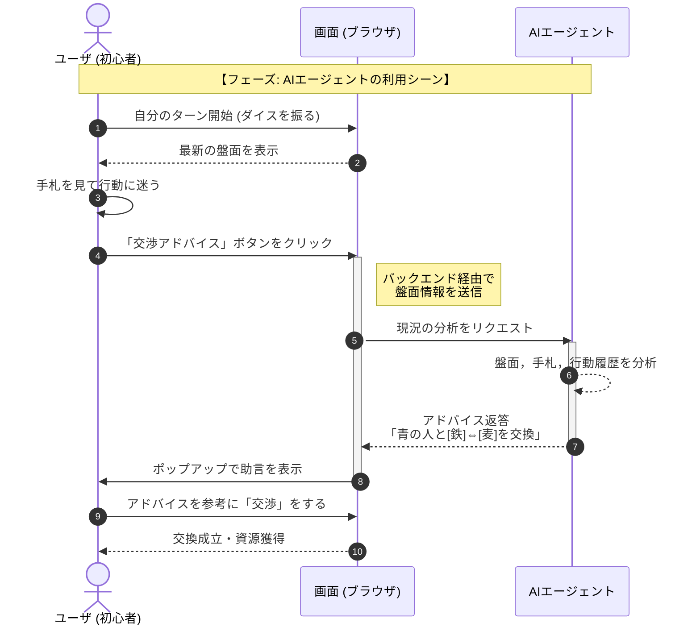

# 交渉アドバイス利用シーン

```mermaid
sequenceDiagram
    autonumber
    actor User as ユーザ (初心者)
    participant UI as 画面 (ブラウザ)
    participant AI as AIエージェント

    Note over User, AI: 【フェーズ: AIエージェントの利用シーン】

    User->>UI: 自分のターン開始 (ダイスを振る)
    UI-->>User: 最新の盤面を表示

    User->>User: 手札を見て行動に迷う
    User->>UI: 「交渉アドバイス」ボタンをクリック

    activate UI
    Note right of UI: バックエンド経由で<br>盤面情報を送信
    UI->>AI: 現況の分析をリクエスト
    activate AI

    AI-->>AI: 盤面，手札，行動履歴を分析
    AI-->>UI: アドバイス返答<br>「青の人と[鉄]⇔[麦]を交換」
    deactivate AI

    UI->>User: ポップアップで助言を表示
    deactivate UI

    User->>UI: アドバイスを参考に「交渉」をする
    UI-->>User: 交換成立・資源獲得
```

VS Codeでこのファイルを開き、`Ctrl/Cmd+Shift+V` でMarkdownプレビューを開けばシーケンス図を確認できます。
